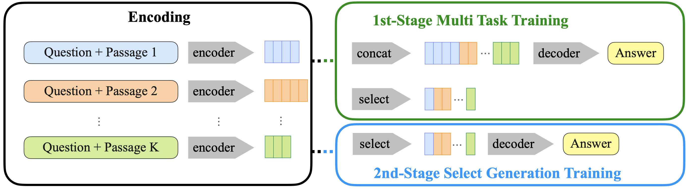
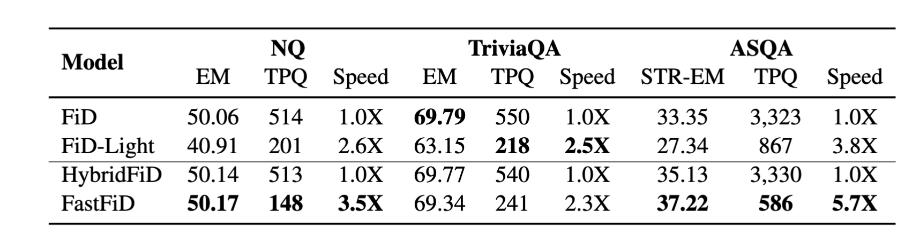

# FastFiD: Improve Inference Efficiency of Open Domain Question Answering via Sentence Selection

This is the official PyTorch implementation for ACL 2024 paper "FastFiD: Improve Inference Efficiency of Open Domain Question Answering via Sentence Selection"

## Quick Links

- [FastFiD: Improve Inference Efficiency of Open Domain Question Answering via Sentence Selection](#fastfid-improve-inference-efficiency-of-open-domain-question-answering-via-sentence-selection)
  - [Quick Links](#quick-links)
  - [Overview](#overview)
  - [Requirments](#requirments)
  - [Model and Data Preparation](#model-and-data-preparation)
    - [Required checkpoints and embeddings](#required-checkpoints-and-embeddings)
    - [Required data files](#required-data-files)
    - [Data Process](#data-process)
  - [Main Experiments](#main-experiments)
    - [First Stage Training](#first-stage-training)
    - [Second Stage Training](#second-stage-training)

## Overview

In this work, we propose FastFiD, which  executes sentence selection on the encoded passages to address the inference efficiency problem of FiD and other similar RAG system. This aids in retaining valuable information while reducing the context length required for generating answers. Experiments on three commonly used datasets (Natural Questions, TriviaQA and ASQA) demonstrate that our method can enhance the inference speed by **2.3X-5.7X**, while simultaneously maintaining the model’s performance.

## Requirments
+ Python: 3.8.12

```shell
pip install -r requirements.txt
```
Note that you should install the correct version of PyTorch that matches your CUDA version. See [PyTorch official website](https://pytorch.org/) for instructions.

## Model and Data Preparation

### Required checkpoints and embeddings

Retriever Model:
+ NQ Retriever: https://github.com/facebookresearch/FiD/blob/main/get-model.sh
+ TQA Retriever: https://github.com/facebookresearch/FiD/blob/main/get-model.sh
+ ASQA use the same retriever as NQ.

Pretrained Model:
+ T5-base: https://huggingface.co/google-t5/t5-base
+ T5-large: https://huggingface.co/google-t5/t5-large
+ Llama2-7B: https://huggingface.co/meta-llama/Llama-2-7b

### Required data files
Wikipedia evidence passages & NQ & TriviaQA & ASQA
+ [Tsinghua Cloud](https://cloud.tsinghua.edu.cn/d/8fca6ce7a4e947348600/)
+ [Google Drive](https://drive.google.com/drive/folders/1UTwbBfmJcC7lXi6PZU8tFZRPGJwuAm81?usp=drive_link)

### Data Process
1. Build retriving index for wikipedia passages using retriever models.
   ```shell
   bash scripts/build_index.sh
   ```
2. Process datas to get retrieved passages for each qa pair.
   ```shell
   bash scripts/evaluate_retriever.sh
   bash scripts/build_qap_dataset.sh
   ```
3. Process data to recognize supported sentences in retrieved passages.
   ```shell
   bash scripts/build_qap_sentence_dataset.sh
   ```

## Main Experiments

### First Stage Training
During the first stage training, we will utilize a multi-task training method, which involves sentence selection and answer generation. By doing this, we will get a model which can not only predict final answer given question and retrieved passages, but also select valuable information in the retrieved passages.

```shell
bash scripts/train_hybrid.sh
```

### Second Stage Training
In this stage, we will train the model to make predictions based only on the selected information to achieve inference acceleration.

```shell
bash scripts/train_select_generation.sh
```